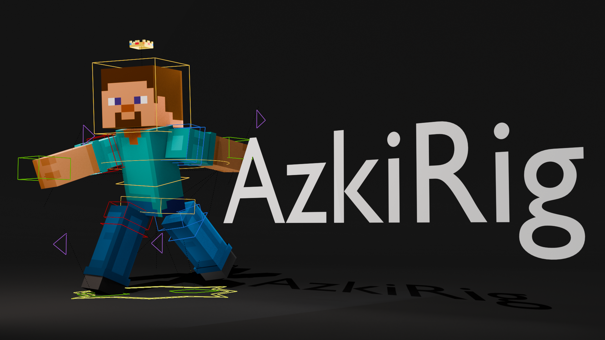
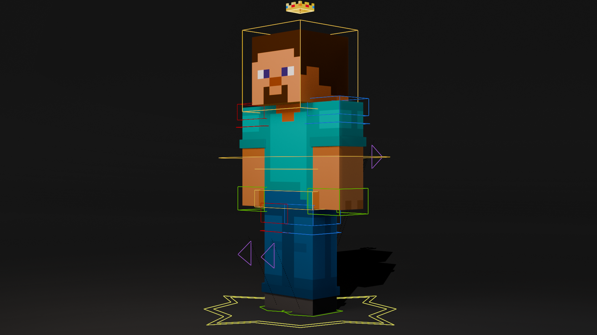
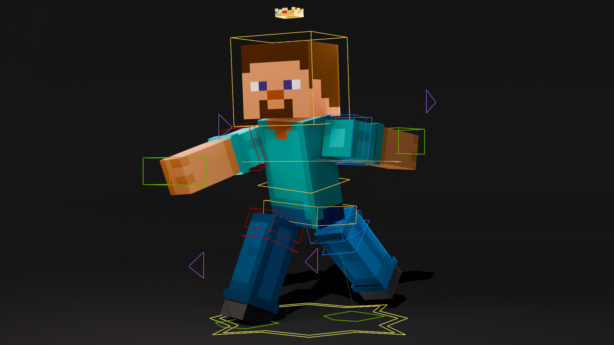

# AzkiRig

A simple and creator-friendly Minecraft Blender rig.

Created by AzkiVIP .

## Features

* Simple workflow
* Easy posing
* Lightweight setup
* Minecraft-focused design
* Crown signature branding

## Preview

---

---

## Version

| Status | Version |
|---------|---------|
| Latest Release | [v1.0.0](https://github.com/AzkiVIP/AzkiRig/releases/tag/v1.0.0) |

[View All Releases](https://github.com/AzkiVIP/AzkiRig/releases)

## Installation

1. Download the latest AzkiRig release from GitHub.
2. Extract the ZIP file.
3. Open `AzkiRig.blend` in Blender.

### Using the Rig

You have two options:

#### Option 1 — Use the included scene

Simply start posing and rendering inside the provided blend file.

#### Option 2 — Append the rig into your project

* Open your Blender project.
* Use File → Append.
* Open `AzkiRig.blend`.
* Append the collection named `AzkiRig`.

### Arm Type Selection

AzkiRig includes multiple arm styles.

Enable the arm type you want to use.

For unused arm types:

* Disable viewport visibility
* Disable render visibility

or hide/uncheck the corresponding collection.

## License

See the [License](LICENSE) file for details.

## Credits

Created by AzkiVIP  .
