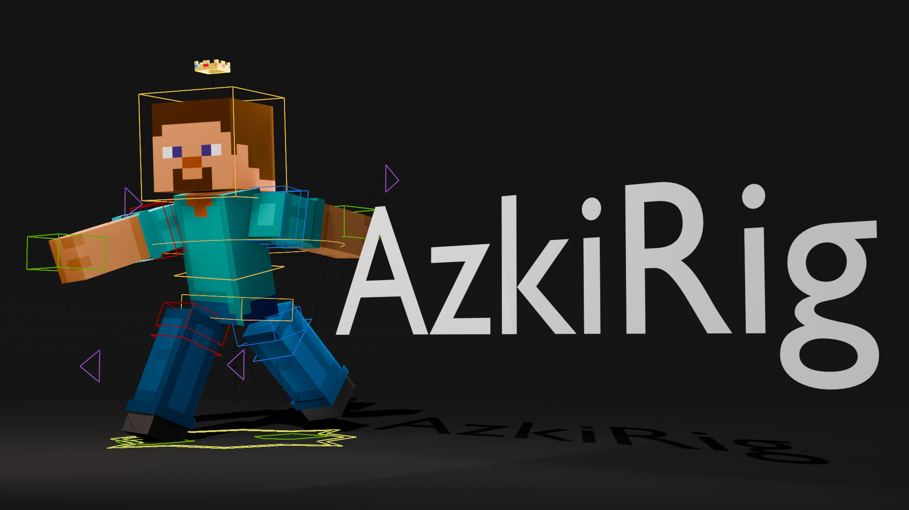
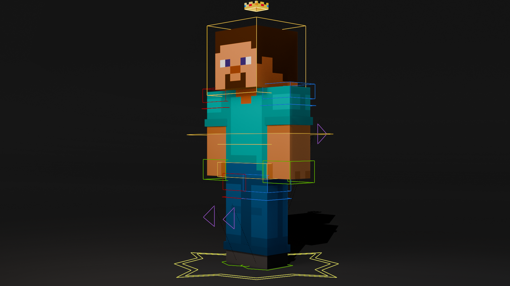
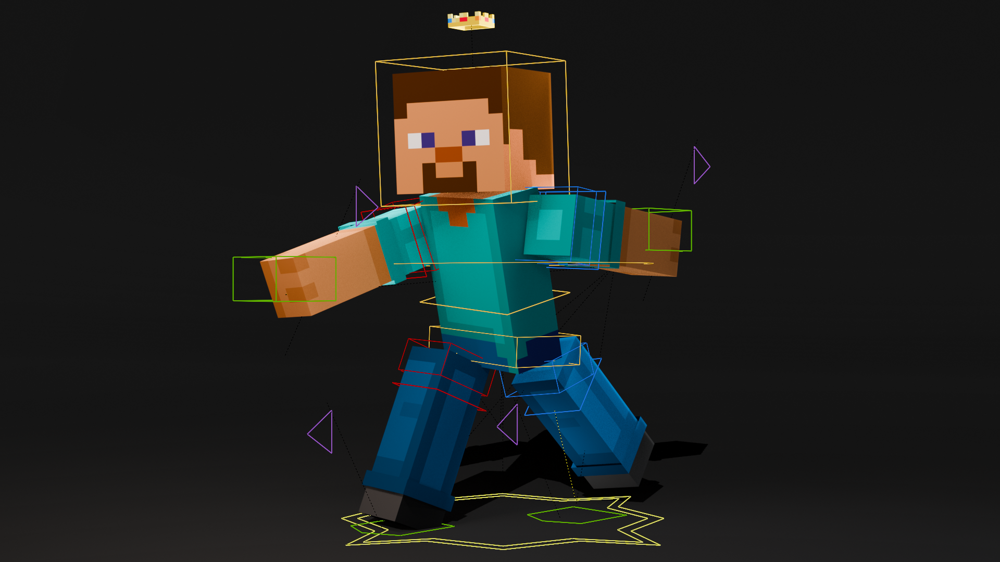

# AzkiRig

A simple and creator-friendly Minecraft Blender rig.

Created by AzkiVIP .

[⬇ Download Latest Release](https://github.com/AzkiVIP/AzkiRig/releases/latest)

---

## Table of Contents

* [Features](#features)
* [Available Versions](#available-versions)
* [Preview](#preview)
* [Version](#version)
* [Compatibility](#compatibility)
* [Installation](#installation)
* [License](#license)
* [Credits](#credits)

---

## Features

* Simple workflow
* Easy posing
* Lightweight setup
* Minecraft-focused design
* Crown signature branding

---

## Available Versions

| Version      | Description                                                    |
| ------------ | -------------------------------------------------------------- |
| AzkiRig Lite | Simplified rig focused on posing and rendering.                |
| AzkiRig Face | Includes facial controls for expressions and character acting. |

---

## Preview

### Render Showcase

---

## Version

| Status         | Version                                                          |
| -------------- | ---------------------------------------------------------------- |
| Latest Release | [v1.1.0](https://github.com/AzkiVIP/AzkiRig/releases/tag/v1.1.0) |

[View All Releases](https://github.com/AzkiVIP/AzkiRig/releases)

---

## Compatibility

Tested on Blender 5.0+

---

## Installation

### Download

1. Download the latest AzkiRig release from GitHub.
2. Extract the ZIP file.
3. Open `AzkiRig.blend` in Blender.

### Using the Rig

You have two options:

#### Option 1 — Use the Included Scene

Simply start posing and rendering inside the provided blend file.

#### Option 2 — Append into Your Project

1. Open your Blender project.
2. Go to **File → Append**.
3. Open `AzkiRig.blend`.
4. Append the collection named **AzkiRig**.

### Arm Type Selection

AzkiRig includes multiple arm styles.

Enable the arm type you want to use.

For unused arm types:

* Disable viewport visibility
* Disable render visibility

Or hide/uncheck the corresponding collection.

---

## License

See the [LICENSE](LICENSE) file for details.

---

## Credits

Created by AzkiVIP .
